# Database Design — FC Upgrade Intelligence

> **Version**: 1.0  
> **Date**: 2026-08-10  
> **Database**: PostgreSQL 16

---

## 1. Entity Relationship Diagram

```mermaid
erDiagram
    %% =====================
    %% CORE GAME DATA
    %% =====================

    Nation {
        int id PK
        string name
        string slug
        string imageUrl
        string code
    }

    League {
        int id PK
        string name
        string slug
        string imageUrl
        int order
        bool isActive
    }

    Team {
        int id PK
        string name
        string slug
        string imageUrl
        int leagueId FK
        bool isActive
    }

    Season {
        int id PK
        int nexonSeasonId
        string name
        string code
        string slug
        string imageUrl
        string description
        datetime releasedAt
        bool isActive
    }

    Player {
        int id PK
        int nexonPlayerId
        string name
        string slug
        string nationality
        int nationId FK
        int defaultTeamId FK
        datetime createdAt
        datetime updatedAt
    }

    PlayerSeason {
        int id PK
        int playerId FK
        int seasonId FK
        int spid
        int teamId FK
        int ovr
        string primaryPosition
        int skillMoves
        int weakFoot
        string attackingWorkRate
        string defensiveWorkRate
        string imageUrl
        string cardImageUrl
        int height
        int weight
        datetime createdAt
        datetime updatedAt
    }

    PlayerPosition {
        int id PK
        int playerSeasonId FK
        string position
        bool isPrimary
        int positionRating
    }

    PlayerAttribute {
        int id PK
        int playerSeasonId FK
        int upgradeLevel
        int pac
        int sho
        int pas
        int dri
        int def
        int phy
        int sprintSpeed
        int acceleration
        int finishing
        int shotPower
        int longShots
        int volleys
        int penalties
        int shortPassing
        int longPassing
        int crossing
        int fkAccuracy
        int curve
        int agility
        int balance
        int reactions
        int ballControl
        int composure
        int dribbling
        int interceptions
        int headingAccuracy
        int marking
        int standingTackle
        int slidingTackle
        int strength
        int stamina
        int jumping
        int aggression
        int gkDiving
        int gkHandling
        int gkKicking
        int gkPositioning
        int gkReflexes
        datetime createdAt
        datetime updatedAt
    }

    PlayerTrait {
        int id PK
        int playerSeasonId FK
        string trait
    }

    PlayerSkill {
        int id PK
        int playerSeasonId FK
        string skillName
        string category
    }

    %% =====================
    %% UPGRADE DOMAIN
    %% =====================

    UpgradeAttempt {
        uuid id PK
        int playerSeasonId FK
        int upgradeLevel
        bool isSuccess
        int baitCountBefore
        string gameServer
        uuid userId FK
        bool isAnonymous
        string ipHash
        datetime attemptedAt
        datetime createdAt
    }

    BaitSequence {
        uuid id PK
        int playerSeasonId FK
        int upgradeLevel
        int totalFailsBefore
        int consecutiveFailsBefore
        bool endedWithSuccess
        float baitProbabilityScore
        uuid userId FK
        datetime createdAt
    }

    BaitEvent {
        uuid id PK
        uuid baitSequenceId FK
        uuid upgradeAttemptId FK
        int sequencePosition
        bool isSuccess
        datetime eventAt
    }

    %% =====================
    %% ML / PREDICTION
    %% =====================

    Prediction {
        uuid id PK
        int playerSeasonId FK
        int upgradeLevel
        float predictedSuccessRate
        float confidenceLow
        float confidenceHigh
        string modelVersionId FK
        string features
        datetime predictedAt
    }

    ModelVersion {
        string id PK
        string name
        string algorithmType
        float accuracy
        float precision
        float recall
        float f1Score
        float aucRoc
        string artifactPath
        int trainingSamples
        datetime trainedAt
        bool isActive
    }

    %% =====================
    %% DATA MANAGEMENT
    %% =====================

    DataSource {
        int id PK
        string name
        string type
        string baseUrl
        string authType
        string configJson
        bool isActive
        datetime createdAt
    }

    DatasetVersion {
        int id PK
        int dataSourceId FK
        string version
        int recordCount
        string checksum
        string filePath
        datetime importedAt
        bool isActive
    }

    ImportJob {
        uuid id PK
        int dataSourceId FK
        string status
        string entityType
        int recordsProcessed
        int recordsFailed
        string errorLog
        datetime startedAt
        datetime completedAt
        string triggeredBy
    }

    %% =====================
    %% USER DOMAIN
    %% =====================

    User {
        uuid id PK
        string email
        string passwordHash
        string displayName
        string avatarUrl
        string role
        string oauthProvider
        string oauthId
        bool isActive
        bool isVerified
        datetime lastLoginAt
        datetime createdAt
        datetime updatedAt
    }

    FavoritePlayer {
        uuid id PK
        uuid userId FK
        int playerSeasonId FK
        int preferredLevel
        string notes
        datetime createdAt
    }

    %% =====================
    %% RELATIONSHIPS
    %% =====================

    League ||--o{ Team : "has clubs"
    Nation ||--o{ Player : "nationality"
    Team ||--o{ Player : "default team"

    Player ||--o{ PlayerSeason : "has versions"
    Season ||--o{ PlayerSeason : "contains cards"
    Team ||--o{ PlayerSeason : "team assignment"

    PlayerSeason ||--o{ PlayerPosition : "positions"
    PlayerSeason ||--o{ PlayerAttribute : "attributes by level"
    PlayerSeason ||--o{ PlayerTrait : "traits"
    PlayerSeason ||--o{ PlayerSkill : "skills"

    PlayerSeason ||--o{ UpgradeAttempt : "upgrade history"
    User ||--o{ UpgradeAttempt : "submitted by"

    PlayerSeason ||--o{ BaitSequence : "bait analysis"
    User ||--o{ BaitSequence : "analyzed by"
    BaitSequence ||--o{ BaitEvent : "events"
    UpgradeAttempt ||--o{ BaitEvent : "referenced"

    PlayerSeason ||--o{ Prediction : "predictions for"
    ModelVersion ||--o{ Prediction : "generated by"

    DataSource ||--o{ DatasetVersion : "versions"
    DataSource ||--o{ ImportJob : "jobs"

    User ||--o{ FavoritePlayer : "favorites"
    PlayerSeason ||--o{ FavoritePlayer : "favorited by"
```



---

## 2. Entity Descriptions

### 2.1 Player vs. PlayerSeason

> **CRITICAL DISTINCTION**: `Player` is the real-world footballer. `PlayerSeason` is a specific in-game card version of that player.

**Example**:
- `Player`: Cristiano Ronaldo (id: 1, nexonPlayerId: 12345)
- `PlayerSeason` 1: Ronaldo — Season 2022 (OVR 98, SPT type)
- `PlayerSeason` 2: Ronaldo — Season 2023 Draft Pick (OVR 102)
- `PlayerSeason` 3: Ronaldo — Icon Player card (OVR 115)

The `spid` field in `PlayerSeason` is the composite Nexon identifier:
```
spid = seasonId * 1,000,000 + nexonPlayerId
e.g., spid = 2200 * 1,000,000 + 90649 = 2,200,090,649
```

---

### 2.2 Season

Season codes observed from the reference site:

| Code | Example ID | Description |
|------|-----------|-------------|
| DP | 25DP | Draft Pick (season year) |
| SPT | SPT | Special card type |
| IP | IP | Icon Player |
| CB | CB | Club Bonus |
| LR | LR | League Record |

---

### 2.3 PlayerAttribute

- One row per `(playerSeasonId, upgradeLevel)` combination
- 10 rows per PlayerSeason (levels 1-10)
- Attributes include both main stats and detailed sub-stats
- GK attributes included (set to 0 for non-GK players)

---

### 2.4 UpgradeAttempt

- Tracks every single upgrade attempt logged by users
- `baitCountBefore`: number of consecutive failures before this attempt
- `isAnonymous`: if true, user data is not stored
- `ipHash`: anonymized IP for fraud detection (not stored in plain text)
- `gameServer`: "VN" (Vietnam), "KR" (Korea), "GLOBAL" etc.

---

### 2.5 BaitSequence

"Bait" is an FC Online mechanic (unofficial term) where consecutive failures increase the probability of the next success. This entity tracks detected bait patterns.

- `totalFailsBefore`: total failures in the sequence up to this point
- `consecutiveFailsBefore`: unbroken chain of failures
- `baitProbabilityScore`: 0.0 to 1.0, ML-computed

---

### 2.6 ModelVersion

- Tracks each trained ML model
- `algorithmType`: "logistic_regression", "random_forest", "xgboost"
- `isActive`: only one model can be active at a time per algorithm type
- `artifactPath`: S3 or local path to the serialized model file

---

## 3. Key Indexes

```sql
-- Player lookup
CREATE INDEX idx_player_nexon_id ON "Player"(nexon_player_id);
CREATE INDEX idx_player_season_spid ON "PlayerSeason"(spid);
CREATE INDEX idx_player_season_player_id ON "PlayerSeason"(player_id);
CREATE INDEX idx_player_season_season_id ON "PlayerSeason"(season_id);

-- Upgrade statistics (hot queries)
CREATE INDEX idx_upgrade_player_season_level ON "UpgradeAttempt"(player_season_id, upgrade_level);
CREATE INDEX idx_upgrade_attempted_at ON "UpgradeAttempt"(attempted_at);
CREATE INDEX idx_upgrade_user_id ON "UpgradeAttempt"(user_id);

-- Full-text search
CREATE INDEX idx_player_name_search ON "Player" USING gin(to_tsvector('english', name));
CREATE INDEX idx_player_season_ovr ON "PlayerSeason"(ovr);

-- Bait analysis
CREATE INDEX idx_bait_sequence_player ON "BaitSequence"(player_season_id, upgrade_level);
```

---

## 4. Computed/Materialized Views

```sql
-- Aggregate upgrade stats per card per level (refresh every 5 min via cron)
CREATE MATERIALIZED VIEW mv_upgrade_stats AS
SELECT
    player_season_id,
    upgrade_level,
    COUNT(*) as total_attempts,
    SUM(CASE WHEN is_success THEN 1 ELSE 0 END) as success_count,
    ROUND(AVG(CASE WHEN is_success THEN 1.0 ELSE 0.0 END) * 100, 2) as success_rate_pct,
    MAX(attempted_at) as last_updated
FROM "UpgradeAttempt"
GROUP BY player_season_id, upgrade_level;

CREATE INDEX idx_mv_upgrade_stats_player ON mv_upgrade_stats(player_season_id, upgrade_level);
```

---

## 5. Data Constraints

```sql
-- Upgrade level must be 1-10
ALTER TABLE "UpgradeAttempt" ADD CONSTRAINT chk_upgrade_level CHECK (upgrade_level BETWEEN 1 AND 10);
ALTER TABLE "PlayerAttribute" ADD CONSTRAINT chk_attr_level CHECK (upgrade_level BETWEEN 1 AND 10);

-- OVR must be positive
ALTER TABLE "PlayerSeason" ADD CONSTRAINT chk_ovr_positive CHECK (ovr > 0);

-- Skill moves and weak foot must be 1-5
ALTER TABLE "PlayerSeason" ADD CONSTRAINT chk_skill_moves CHECK (skill_moves BETWEEN 1 AND 5);
ALTER TABLE "PlayerSeason" ADD CONSTRAINT chk_weak_foot CHECK (weak_foot BETWEEN 1 AND 5);

-- Bait probability score must be 0-1
ALTER TABLE "BaitSequence" ADD CONSTRAINT chk_bait_score CHECK (bait_probability_score BETWEEN 0.0 AND 1.0);
```

---

## 6. Soft Delete Strategy

Entities use `isActive` or `updatedAt` + `deletedAt` pattern rather than hard deletes:
- `Player`, `PlayerSeason`, `Season`, `Team`, `League`: use `isActive` flag
- `User`: use `isActive` flag + soft delete flag
- `UpgradeAttempt`: hard delete not allowed (preserve statistical integrity)
- `ImportJob`: never deleted (audit trail)

---

## 7. Multi-tenancy / Server Support

For future support of multiple game servers (Vietnam vs Korea):
- `UpgradeAttempt.gameServer` field stores the server identifier
- Statistics can be filtered by server in Phase 2
- `PlayerSeason` data may differ between servers (different OVR caps)

---

## 8. Naming Conventions

| Convention | Rule |
|------------|------|
| Tables | PascalCase in quotes |
| Columns | snake_case |
| PKs | always `id` |
| FKs | `{entity}_id` |
| Booleans | `is_*` or `has_*` prefix |
| Timestamps | `*_at` suffix (datetime) |
| Soft delete | `is_active` boolean |
